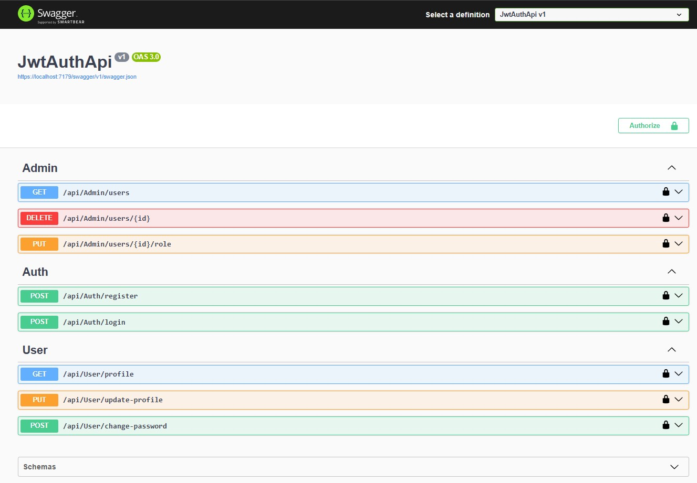

# API de Autenticación JWT con .NET 8

API de autenticación desarrollada en ASP.NET Core que utiliza JWT (JSON Web Tokens) + Contraseñas Hasheadas con Identity para la autenticación de usuarios. Incluye funcionalidades de registro, login y gestión de usuarios.

## Tecnologías utilizadas
- **ASP.NET Core Web API RESTful .NET 8**
- **Entity Framework Core**
- **SQL Server**
- **JWT + Identity**
- **Swagger** (para documentación automática)

## Requisitos previos
Antes de ejecutar la API, asegúrate de tener instalado lo siguiente:
- [Visual Studio 2022](https://visualstudio.microsoft.com/es/vs/) o [Visual Studio Code](https://code.visualstudio.com/)
- [SQL Server](https://www.microsoft.com/es-es/sql-server/sql-server-downloads) (podés usar SQL Server Express o LocalDB)

## Configuración
1. **Clona el repositorio:**
   ```bash
   git clone https://github.com/AngelSpinazzola/JwtAuthApi

2. **Configura la cadena de conexión:**

Abre el archivo appsettings.Template.json y verifica la cadena de conexión a SQL Server:
```bash
"ConnectionStrings": {
    "DefaultConnection": "Server=.\\SQLEXPRESS;Database=MyJwtAuthDb;Trusted_Connection=True;TrustServerCertificate=true;"
}
```
Si usas una instancia diferente de SQL Server, modifica la cadena de conexión según corresponda.

Ejecuta las migraciones (en la consola de visual studio) para crear la base de datos:

```bash
dotnet ef database update
```
3. **Configura el JWT:**

En el archivo appsettings.json, podés personalizar la configuración del JWT:

```bash
"Jwt": {
    "Key": "EstaEsUnaClaveSecretaSuperSeguraDe32Caracteres",
    "Issuer": "https://localhost:5001",
    "Audience": "https://localhost:5001",
    "ExpireMinutes": 60
}
```
La clave (Key) debe tener al menos 32 caracteres.

4. **Ejecutar la API:**

Compila la API en el visual studio
   

5. **Accede a la documentación de Swagger:**

Navega a https://localhost:5001/swagger para ver la interfaz de Swagger y probar los endpoints.


